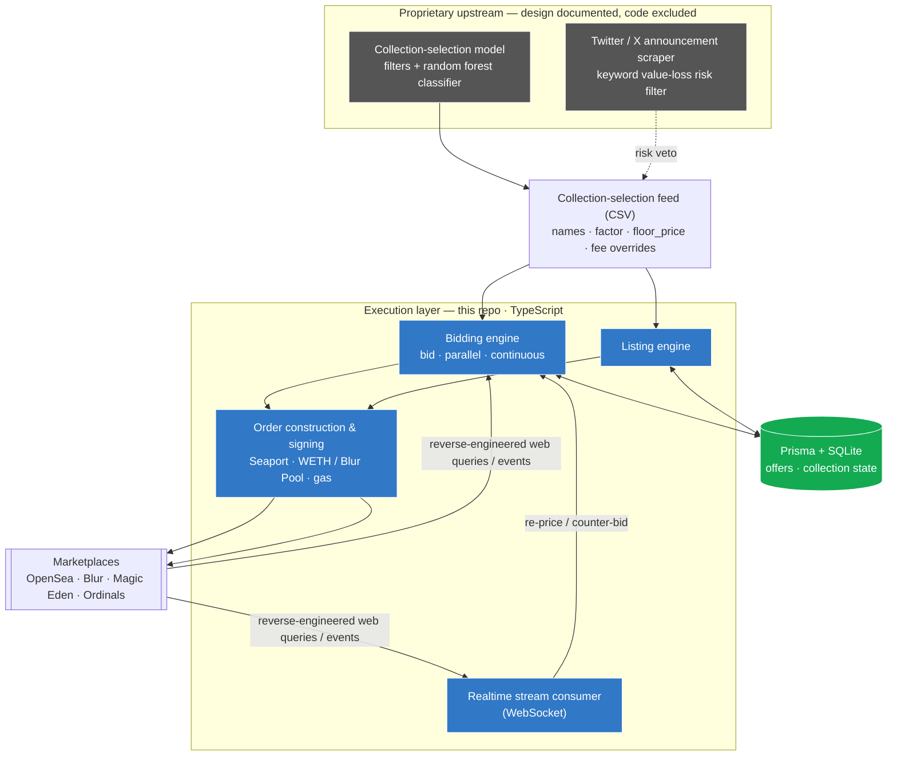

# NFT Trading Bot

A reference / work-sample for a **multi-marketplace, ML-driven NFT trading system** that
placed and managed collection offers and listings on the Ethereum mainnet — documented here
through an architecture flow-chart, the decision algorithm, and a sanitized slice of the
execution layer.

> **⚠️ Disclaimer**
>
> This repository is published as a professional work sample and serves as evidence that the
> system described below was designed and developed. It contains only a **sanitized portion of
> the execution layer** and **does not constitute the full bot logic.** The upstream
> collection-selection / machine-learning models and the Twitter/X announcement scraper are
> proprietary: their **design is documented** (see [Algorithm System](#algorithm-system)), but
> **no model code, training data, or scraper source is published.** The material here is
> provided solely for demonstration and verification, and is not intended to run as a complete
> system.

## Contributors

Developed from 2022–2026 by a small remote team, led by [@Immersified](https://github.com/Immersified):

- **Shola Ayeni** — [@ayenisholah](https://github.com/ayenisholah)
- **Immersified** — [@Immersified](https://github.com/Immersified) (lead)
- **Stefan** — [@FinalDayz](https://github.com/FinalDayz)
- **Alexis**

> _Note: this repository was published as a sanitized work-sample with a fresh commit history,
> so the GitHub contribution graph does not reflect each member's original commit volume._

---

## At a glance

| | |
|---|---|
| **Domain** | Automated NFT trading · on-chain execution · applied ML |
| **What it does** | Places & manages collection offers and listings on Ethereum mainnet |
| **Marketplaces** | OpenSea · Blur · Magic Eden · Bitcoin Ordinals — from one codebase |
| **Lifespan** | 2022–2026 · maintained through a ~90% drop in NFT market volume |
| **Team** | Small remote team — 7 hires total, up to 3 concurrent (lead author) |
| **This repo** | Sanitized **execution layer** (TypeScript); upstream ML & scraper excluded |

**Spans the full stack of an automated trading operation:** a proprietary
collection-selection model (research & ML), an announcement-risk scraper, and the
execution layer included here — order construction & signing, multi-marketplace integration,
a realtime event stream, and persisted order state.

---

## What problem does it solve?

Profitable NFT trading at scale needs three things humans can't do by hand: continuously
**decide** which collections are mispriced, continuously **avoid** collections about to lose
value, and continuously **execute** offers/listings across several marketplaces faster than
the floor moves. The system splits cleanly along those lines:

1. **Decide (proprietary)** — a collection-selection model scores collections and emits a
   per-collection `factor` and `floor_price`. *See [Algorithm System](#algorithm-system).*
2. **De-risk (proprietary)** — a keyword Twitter/X scraper watches for collection
   announcements that signal value-loss risk and vetoes buys.
3. **Execute (this repo)** — a TypeScript engine turns that feed into signed on-chain orders,
   reacts to a realtime marketplace stream, and persists every position.

---

## System architecture



> **Clean separation of concerns:** the proprietary model owns *what to trade* (see
> [Algorithm System](#algorithm-system)), the execution layer in this repo owns *placing &
> managing the trade reliably* (deep-dive in [`docs/architecture.md`](docs/architecture.md)),
> and SQLite is the single source of truth so positions survive restarts.

---

## Algorithm System
The algorithm starts with scraping top collections in terms of volume. Here, metrics like floor price, sale activity, number of tokens and holders (see Figure 1) are used to filter the initial wave of collections.

<p align="center">
  
  <br>
  <em>Figure 1: Combined collection metrics after initial filtering wave. On top, the number of collections the bot would bit on are seen. Below, metrics like the percentage difference between the floor price and highest offer price are shown
    including ETH & WETH merket volume, Bid / Ask ratio (ETH / WETH) and the Ethereum price.</em>
</p>

From the 1000 collections, about 20 go through a more rigorous filter with varying metrics to determine a collection's performance. Here, one can think of price slope filters, collection listings, number of buyers and sellers, ask-to-bid ratio and floor price changes.
Results of these metrics are fed to a random forest classifier which determines the confidence on whether to place a bid on the collection. If the threshold is met, the offer price is determined in combination with the floor price and most recent sale prices.
The final collections are extracted into a CSV file and sent to the bot.

### Calibration
To adjust settings to the market accordingly, the bot is calibrated weekly. Here, the most optimal random forest classifier including offer price metrics are calculated.
This is done by scraping NFT sales from own plus other wallets with the collection variables attached during the purchase period. Afterward, a grid-search is executed to find the best classifier and metrics.
A result of such can be seen in Figure 2, here, the optimization system applies a combination of total profit gained plus win rate to determine the most suitable algorithm.

<p align="center">
  
  <br>
  <em>Figure 2: Performance comparison of random forest models between the current and previous calibration.</em>
</p>

The calibration system has numerous intricacies like a walk-forward system with specific train and testing periods. Moreover, the data set used always nets to break-even in terms of profit to ensure it is non-biased.

---

## CV highlights

The full system was built and led by the repository author. Measurable outcomes from the
project (the items marked *proprietary* describe components whose code is excluded):

- **Algorithmic collection-selection system** *(proprietary)* — designed the model that
  decides which collections to bid on and at what price (see [Algorithm System](#algorithm-system)),
  driving the offers this execution layer places on Ethereum mainnet.
- **Profitable through a ~90% market-volume collapse** *(proprietary)* — experimented across
  forest classifier, forest regression, gradient boosting, and a custom ML model, adapting
  the selection strategy to keep the system profitable as NFT volume fell ~90%.
- **Reverse-engineered marketplace web queries** — reconstructed the queries behind
  marketplace web clients to read data the public APIs don't expose, collapsing what took the
  official API **~100 calls into a single request** (`utils/proList.ts`,
  `utils/graphql/query/`).
- **Twitter/X announcement scraper** *(proprietary)* — built a comprehensive keyword scraper
  that surfaced collection announcements and **prevented ~60% of would-be purchases** that
  carried significant value-loss risk.
- **Built and led the team** — recruited and led a small remote team (7 hires total, up to 3
  concurrent), owning sprint planning, technical mentorship, and strategic direction
  alongside core algorithm development.

---

## Key features (execution layer — in this repo)

- **Places collection offers on Ethereum mainnet** — constructs and signs
  [Seaport](https://github.com/ProjectOpenSea/seaport) orders, manages WETH / Blur Pool
  balances, and submits bids driven by `factor` × `floor_price` inputs.
- **Multi-marketplace from one codebase** — OpenSea, Blur, Magic Eden, and Bitcoin Ordinals:
  bidding, listing, and accepting the best offers on each.
- **Reverse-engineered marketplace access** — reconstructs web-client queries for trait-level
  and collection-level data the REST APIs don't return (see below).
- **Realtime reaction over WebSocket** — consumes a marketplace event stream and re-prices /
  counter-bids as floors and offers move.
- **Persisted order state** — Prisma + SQLite so positions survive restarts.
- **Rate-limit aware & concurrent** — `bottleneck` + `p-queue` keep throughput high without
  tripping marketplace limits.

### Reverse-engineered marketplace access

Marketplaces gate their richest data (trait floors, signed-order flows, pro listing
endpoints) behind their web clients rather than their public APIs. This bot reconstructs
those web queries directly — e.g. the OpenSea Pro listing/auth flow (`utils/proList.ts`) and
the GraphQL queries under `utils/graphql/query/` — reading data the REST API does not return
and collapsing ~100 paginated REST calls into a single request.

---

## Tech stack

| Area | Technology |
|------|------------|
| Language | TypeScript (Node.js) |
| Chain / signing | `ethers` v5 · `web3` · Seaport order components |
| Persistence | Prisma ORM + SQLite |
| Concurrency / rate limiting | `bottleneck` · `p-queue` |
| Realtime | `ws` (marketplace event stream) |
| Bitcoin Ordinals | `bitcoinjs-lib` · `ecpair` · `@bitcoinerlab/secp256k1` |
| Data inputs | CSV-driven collection config (`csv-parser`) |

---

## Repository layout

```
src/
  bid.ts, bid_new.ts, continuosBidding.ts, parallel.ts   # bidding entry points / loops
  list.ts, ordinals.ts                                    # listing + ordinals entry points
  websocket.ts                                            # realtime event-stream consumer
  functions/                                              # marketplace logic
    offer.ts, list.ts, collection.ts, wallet.ts
    magiceden/                                            # Magic Eden integrations
    ordinals/                                             # Bitcoin Ordinals integrations
  utils/                                                  # Seaport payloads, balances, gas, signing
    seaport.ts, payload.ts, proList.ts, fees.ts
    graphql/query/                                        # reverse-engineered marketplace queries
  api/nfttools.ts                                         # marketplace data proxy client
  config/                                                 # env-backed configuration
prisma/schema.prisma                                      # Offer / collection models
Bidding/, Listing/, Settings/                             # collection-selection inputs (CSV)
docs/architecture.md                                      # execution-flow deep-dive
```

---

## Configuration

All credentials are read from environment variables — **no secrets are committed.** Copy
`.env.example` to `.env` and supply your own keys:

| Variable | Purpose |
|----------|---------|
| `ALCHEMY_API_KEY` | Ethereum RPC provider (mainnet) |
| `API_KEY` | NFTTools data-proxy key |
| `OPENSEA_API_KEY` | OpenSea REST + stream access |
| `PRIVATE_KEY` | Trading wallet signing key |
| `FUNDING_WIF` | Bitcoin Ordinals funding key (WIF) |
| `TOKEN_RECEIVE_ADDRESS` | Address that receives purchased tokens |
| `X_API_KEY` | Extra marketplace key (optional) |
| `RATE_LIMIT`, `DEFAULT_OUTBID_MARGIN`, `DEFAULT_LOOP` | Execution tuning knobs |

Collection targets are defined in the `Bidding/`, `Listing/`, and `Settings/` CSV files
(`names`, `factor`, `floor_price`, fee overrides) — one representative file is included for
each path.

---

## Running

```bash
npm install
npx prisma migrate dev      # initialize the local SQLite store
npm run bid                 # run the bidding engine
npm run listing             # run the listing engine
npm run websocket           # run the realtime stream consumer
```

See `package.json` for the remaining entry points (`bid:parallel`, `bid:continuous`,
`bid:ordinals`).

---

## Disclaimer

Published as a portfolio / work-sample. Provided as-is, with no warranty. Automated on-chain
trading carries financial risk; use at your own risk and supply your own credentials.

<sub>Architecture diagrams are written in <a href="https://mermaid.js.org/">Mermaid</a> and
render automatically on GitHub.</sub>
