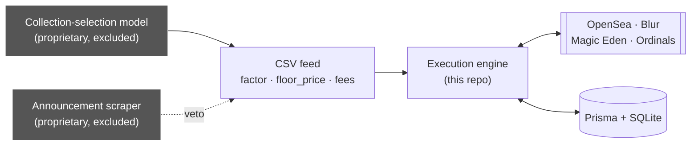
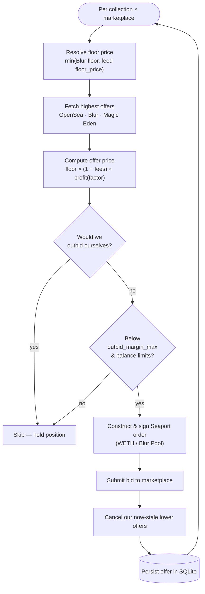

# Execution Layer — Architecture

This document describes the **execution layer** included in this repository — the part that
turns a collection-selection feed into signed on-chain orders and manages them across
marketplaces. The upstream collection-selection model and Twitter/X scraper that *produce*
that feed are proprietary and excluded; they appear here only as inputs.

[Back to README](../README.md)

---

## 1. Where the execution layer sits



The feed is intentionally a **simple CSV contract** (`names`, `factor`, `floor_price`, fee
overrides). That keeps the proprietary model fully decoupled from execution: the model can be
rewritten or retrained without touching a line of the engine, and the engine can be tested
against hand-written CSVs.

---

## 2. Bidding loop

The bidding engine (`src/bid_new.ts`, with `parallel.ts` / `continuosBidding.ts` as scaling
variants) runs the following loop per collection, across every configured marketplace.



Key rules enforced in the loop:

- **Never outbid ourselves**, and never outbid our own bots running on other wallets.
- **Dynamically adjust the offer** — if our bid is far above the next-highest offer, step it
  down toward `next_offer + margin` rather than leaving capital on the table.
- **Cancel lower offers** that are superseded during outbidding.
- **Respect balance ceilings** (`wethBalanceMax`, `blurPoolBalanceMax`, `ethBalanceMin`) and
  the per-collection `profit_max_ceil`.

### Offer-price formula

```
offerPrice = floorPrice × ((100 − creatorFee − royaltyFee) / 100) × profit(factor)
```

`factor` comes from the collection-selection feed; `profit(factor)` caps the bid below a
configured profit ceiling so the bot only ever offers at a price it can resell into.

---

## 3. Realtime stream

`src/websocket.ts` subscribes to a marketplace event stream. When a floor or a competing
offer moves, the engine re-enters the pricing step above for the affected collection and
counter-bids — without waiting for the next polling cycle. This is what keeps the bot
competitive on fast-moving collections.

---

## 4. Reverse-engineered marketplace access

Marketplaces expose far less through their public REST APIs than through their own web
clients. The engine reconstructs the web-client queries directly:

- `src/utils/proList.ts` — the OpenSea Pro listing / auth-challenge flow.
- `src/utils/graphql/query/` — GraphQL documents for order, login-challenge, and
  fulfill-action flows.

This unlocks trait-level and signed-order data the REST API never returns, and collapses what
the official API needed **~100 paginated calls** for into a **single request** — the single
biggest throughput win in the system.

---

## 5. Persistence

A small Prisma + SQLite schema (`prisma/schema.prisma`) is the engine's source of truth:

| Model | Purpose |
|---|---|
| `Offer` | Live offers (`orderHash`, `collection`, `offerPrice`, `expirationTime`) |
| `collectionDetails` | Per-collection fee / contract metadata used during pricing |

Because state lives in the database rather than in memory, the engine can restart mid-session
and reconcile its outstanding offers instead of double-bidding.

[Back to README](../README.md)
